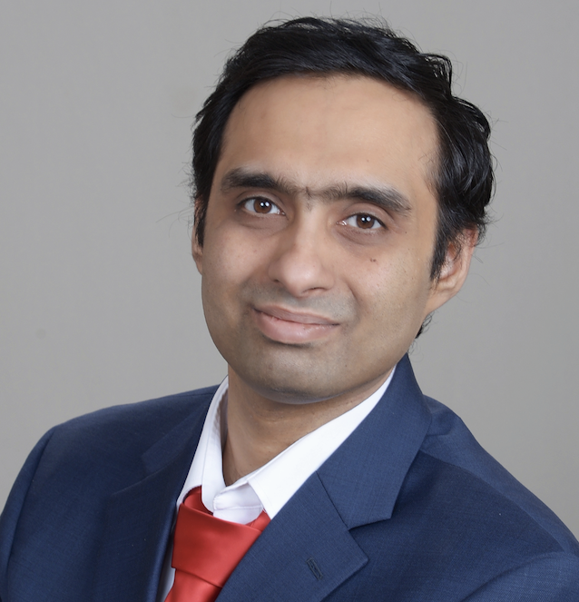

---
# Feel free to add content and custom Front Matter to this file.
# To modify the layout, see https://jekyllrb.com/docs/themes/#overriding-theme-defaults

layout: home
---

<table style="border: none !important;">
<tbody>
<tr style="border: none !important; padding:0px">
  <td style="border: none !important; padding:0.1%; width:83%">
      Hello, I am Athindran. I am currently a machine learning engineer in Behavior Planning at Aurora Innovation in Pittsburgh, PA. I was a sixth-year PhD student in the Department of Electrical and Computer Engineering at Princeton University. I was fortunate to be advised by Prof. Peter Ramadge.
  
  

    <a href="PDFs/Athindran_jan2_2026.pdf">Resume</a> /
    <a href="https://scholar.google.com/citations?user=KzDwYYMAAAAJ&hl=en&oi=ao">Google Scholar</a> /
    <a href="https://github.com/athindran">Github</a> /
    <a href="www.linkedin.com/in/athindran-ramesh-kumar-33450132">LinkedIn</a> /
    <a href="https://x.com/athindran">Twitter</a> /
  

  </td>
  <td style="border: none !important; padding:1%; width:15%; max-width:15%">
    
  </td>
</tr>
</tbody>
</table>

## Research

My research was focused on designing safety fallback mechanisms for autonomous systems with provable guarantees. I utilize various tools, ranging from classical control to model-based optimization, to enable these filters to satisfy desirable properties such as smooth handover and robustness to imperfect models. My general research focus over the past few years has been on applying optimization and learning methods to control applications.

<!--
Prior research work focused on an eclectic mix of topics ranging from computer vision, deep learning, wireless communication, and PNT  (Positioning, Navigation, and Timing). My primary expertise lies in control, deep learning, and robotics. I am therefore excited to  continue to learn more about reinforcement learning because of the change in outlook it has brought to these areas. My research, though not primarily theoretical, is greatly enhanced by mathematical exposition that helps me understand the methods to the depth necessary. I often find it interesting to explore the engineering enhancements needed to bring it out of the research lab.
-->

## Publications

1. A. R. Kumar, K. -C. Hsu, P. J. Ramadge and J. F. Fisac, "Fast, Smooth, and Safe: Implicit Control Barrier Functions through Reach-Avoid Differential Dynamic Programming," in IEEE Control Systems Letters, doi: 10.1109/LCSYS.2023.3292132 [Link to paper](https://sites.google.com/view/fsslcss/home)
2. Liang Heng, Athindran Ramesh Kumar and Grace Xingxin Gao, Location Hash: Private Proximity Detection Using Partial GPS Information, IEEE Transactions on Aerospace and Electronic Systems. Dec. 2016. [Link to paper](http://ieeexplore.ieee.org/document/7855590/)
3. Ting-Han Fan, Athindran Ramesh Kumar, Peter J. Ramadge. “Safety Control for Prime Focus Spectrograph.” In 2022 56th Annual Conference on Information Sciences and Systems (CISS) (pp. 269-274). IEEE [Link to paper](https://ieeexplore.ieee.org/document/9751172)
4. Athindran Ramesh Kumar\*, Sulin Liu\*, Jaime F. Fisac, Ryan P. Adams, Peter J. Ramadge. “ProBF: Probabilistic Safety Certificates with Barrier Functions.” Presented at SafeRL workshop at NeurIPS 2021. [Link to paper](https://sites.google.com/view/probf/home)
5. Athindran Ramesh Kumar, Balaraman Ravindran, and Anand Raghunathan. “Pack and detect: Fast object detection in videos using region-of-interest packing.” Proceedings of the ACM India Joint International Conference on Data Science and Management of Data. 2019. [Link](https://dl.acm.org/doi/abs/10.1145/3297001.3297020)  [Featured in TechXplore](https://techxplore.com/news/2018-09-fast-videos-region-of-interest.html)

For a complete list, please visit [Google Scholar](https://scholar.google.com/citations?user=KzDwYYMAAAAJ&hl=en&oi=ao)

## Projects with Code

[Fast, smooth, and safe](https://sites.google.com/view/fsslcss/home)&nbsp;&nbsp;       [Probabilistic Safety with GP](https://sites.google.com/view/probf/home)

## Talks and Presentations

| Control theory and practice   | Deep learning |
| --------------------------------- | ---------------------------------- |
| [ECE General Exam](PDFs/General_Exam_Spring__Copy_.pdf) | [ORFE Deep Learning Theory Seminar](PDFs/Deep_learning_seminar_athindran.pdf)  |
| [ACC 2021](PDFs/ACC_2021_Athindran.pdf)  | [CSML Reading Group GNN part 1](PDFs/CSML_reading_group_seminar1.pdf)  |
| [CISS 2021](PDFs/CISS_2021_Athindran.pdf) | [CSML Reading Group GNN part 2](PDFs/CSML_reading_seminar2.pdf)  |

## Work Experience

- ML Software Engineer, Behavior Planning at Aurora Innovation. Present
- Software Intern, Control at Aurora Innovation. May - Aug 2022
- Research Intern, Nokia Bell Labs. June - Aug 2021
- Research Engineer, Center of Excellence in Wireless Technology. April 2016 - June 2018
- Tech Intern, Google StreetView. May - August 2014

## Reviewer Services

NeurIPS (2022-2024), ICML (2023-2025), ICLR (2021, 2023, 2024), CISS 2022, IJCAI 2024, IEEE RA-L, IEEE TCST.

## Teaching Assistant

- UIUC ECE 456 - Introduction to GNSS systems/GPS - Organized and led the lab sessions as a single TA for the course.
- UIUC ECE 210 - Introduction to Analog and Digital Signal Processing
- PU ELE 364 - Machine Learning for Predictive Data Analytics
- PU ELE 456 - Machine Learning and Pattern Recognition
- PU SML 201 - Introduction to Data Science
- PU EGR 153 - Foundations of Engineering Physics
- PU ELE 203 - Introduction to Circuits
- PU ELE 368 - Introduction to Wireless Communication Systems

## Outside Work

Back in my undergraduate days, I played quite a bit of tennis as a serious extra-curricular and represented the institute at the inter-IIT sports meet and the inter-collegiate sports fest. I was also involved in app development during my undergraduate years. I helped build Android apps for the institute's technical and cultural festivals, Shaastra and Saarang.

## Contact
You can reach me through email at r[dot]athindran[at]gmail[dot]com
