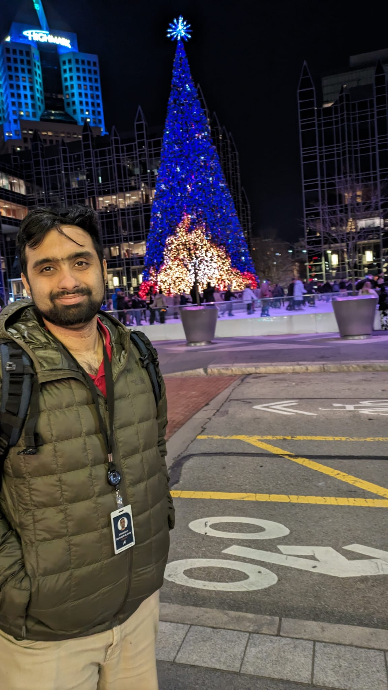

Hi. I am Athindran. I am currently a machine learning engineer in Behavior Planning at Aurora Innovation in Pittsburgh, PA. I was a sixth-year PhD student in the Department of Electrical and Computer Engineering at Princeton University. I am fortunate to be advised by Prof. Peter Ramadge. My research was focused on designing safety fallback mechanisms for autonomous systems with provable guarantees. I utilize various tools, ranging from classical control to model-based safety filters, to enable these filters to satisfy desirable properties such as smooth handover and robustness to imperfect models. My general research focus over the past few years has been on applying optimization and learning methods to control applications.

[ Resume ](PDFs/Athindran_cv_jul62025.pdf) 

[ Github Profile ](https://github.com/athindran) 

[ Google Scholar ](https://scholar.google.com/citations?user=KzDwYYMAAAAJ&hl=en&oi=ao)

[Old Website](https://sites.google.com/site/athindranrameshkumar/home)

## Project pages

[Fast, smooth, and safe](https://sites.google.com/view/fsslcss/home)&nbsp;&nbsp;

[Probabilistic Safety with GP](https://sites.google.com/view/probf/home)

## Talks

| Control theory and practice   | Deep learning |
| --------------------------------- | ---------------------------------- |
| [ECE General Exam](PDFs/General_Exam_Spring__Copy_.pdf) | [ORFE Deep Learning Theory Seminar](PDFs/Deep_learning_seminar_athindran.pdf)  |
| [ACC 2021](PDFs/ACC_2021_Athindran.pdf)  | [CSML Reading Group GNN part 1](PDFs/CSML_reading_group_seminar1.pdf)  |
| [CISS 2021](PDFs/CISS_2021_Athindran.pdf) | [CSML Reading Group GNN part 2](PDFs/CSML_reading_seminar2.pdf)  |

## Journal Papers

1. A. R. Kumar, K. -C. Hsu, P. J. Ramadge and J. F. Fisac, "Fast, Smooth, and Safe: Implicit Control Barrier Functions through Reach-Avoid Differential Dynamic Programming," in IEEE Control Systems Letters, doi: 10.1109/LCSYS.2023.3292132 [Link](https://sites.google.com/view/fsslcss/home)
2. Liang Heng, Athindran Ramesh Kumar and Grace Xingxin Gao, Location Hash: Private Proximity Detection Using Partial GPS Information, IEEE Transactions on Aerospace and Electronic Systems. Dec. 2016. [Link](http://ieeexplore.ieee.org/document/7855590/)

## Conference and Workshop Papers

1. Ting-Han Fan, Athindran Ramesh Kumar, Peter J. Ramadge. “Safety Control for Prime Focus Spectrograph.” In 2022 56th Annual Conference on Information Sciences and Systems (CISS) (pp. 269-274). IEEE [Link](https://ieeexplore.ieee.org/document/9751172)
2. Athindran Ramesh Kumar\*, Sulin Liu\*, Jaime F. Fisac, Ryan P. Adams, Peter J. Ramadge. “ProBF: Probabilistic Safety Certificates with Barrier Functions.” Presented at SafeRL workshop at NeurIPS 2021. [Link](https://sites.google.com/view/probf/home)
3. Athindran Ramesh Kumar, Balaraman Ravindran, and Anand Raghunathan. “Pack and detect: Fast object detection in videos using region-of-interest packing.” Proceedings of the ACM India Joint International Conference on Data Science and Management of Data. 2019. [Link](https://dl.acm.org/doi/abs/10.1145/3297001.3297020)  [Featured in TechXplore](https://techxplore.com/news/2018-09-fast-videos-region-of-interest.html)

For a complete list, please visit [Google Scholar](https://scholar.google.com/citations?user=KzDwYYMAAAAJ&hl=en&oi=ao)

## Work Experience

**Software Engineer, Action at Aurora Innovation. Oct 2023 - Present**

Development and fail-safe testing of motion control/fault management techniques for control of self-driving tractor-trailers

Machine learning modeling for motion planning of self-driving vehicles

**Software Intern, Control at Aurora Innovation. May - Aug 2022**

Implementation of a feature to improve longitudinal control of self-driving trucks

**Research Intern, Nokia Bell Labs. June - Aug 2021**

Reinforcement learning for a robotic arm

**Research Engineer, Center of Excellence in Wireless Technology. April 2016 - June 2018**

Frequency assignment techniques and path loss models for rural environments

**Tech Intern, Google StreetView. May - August 2014**

Carrier phase positioning with GPS to achieve centimeter accurate positioning of StreetView cars

## Outside Work

Back in my undergraduate days, I was crazy about tennis and represented the institute at the inter-IIT sports meet and the inter-collegiate sports fest. I was also part of the gold medal winning team of Tapti hostel in Schroeter 2012.

I was also into app development in my undergraduate days. I helped build android apps for the institute technical and cultural festivals, Shaastra and Saarang.

## Contact
You can reach me through email at r[dot]athindran[at]gmail[dot]com
