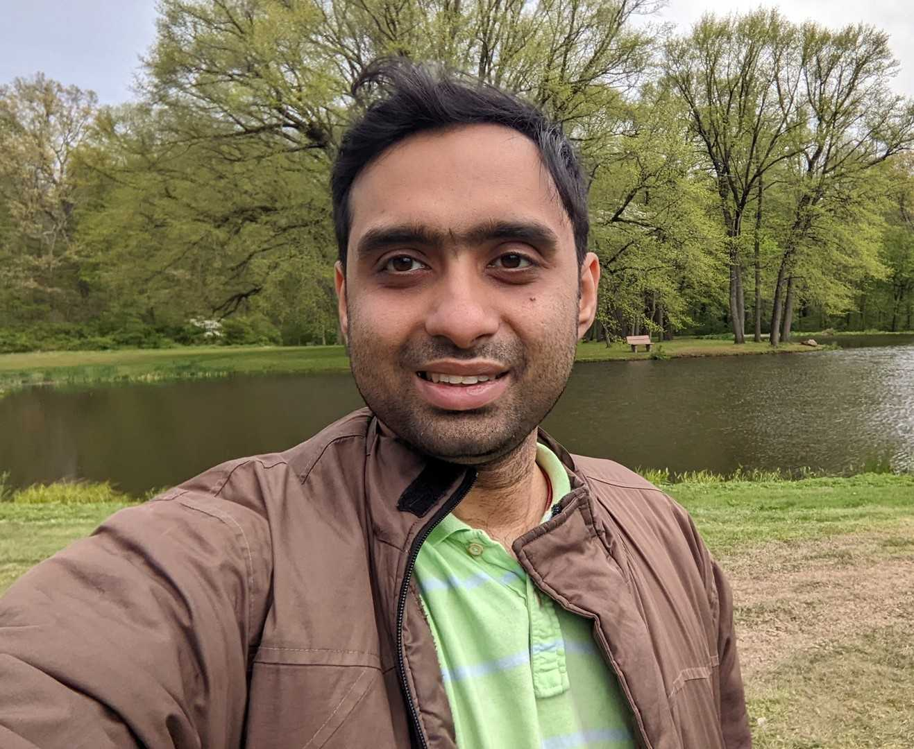

Hi. I am Athindran. I was a sixth year PhD student in the department of Electrical Engineering at Princeton University. I am advised by Prof. Peter Ramadge. My current research is focused on designing safety fallback mechanisms for autonomous systems with provable guarantees. I use various tools from classical control to enable these model-based safety filters to satisfy desirable properties such as smooth handover and robustness to imperfect physics-based models.

Before this, I was a project associate under Prof. Balaraman Ravindran with the Computer Science department of the Indian Institute of Technology, Madras. At this time, I also concurrently worked as a research engineer at the Center of Excellence in Wireless Technology, IIT Madras. 

&nbsp;[ CV ](PDFs/Athindran_resume_December2.pdf) &nbsp;&nbsp;&nbsp;[Github Profile ](https://github.com/athindran) &nbsp;&nbsp;&nbsp; [ Google Scholar ](https://scholar.google.com/citations?user=EFARMYIAAAAJ&hl=en)

## Project pages

[Fast, smooth and safe](https://sites.google.com/view/fsslcss/home) &nbsp;&nbsp;

[Probabilistic Safety with GP](https://sites.google.com/view/probf/home)

## Talks

[Princeton ECE Pre-FPO](PDFs/Safety%20guarantees%20in%20control.pptx)

[Princeton ORFE Deep Learning Theory Seminar](PDFs/Deep_learning_seminar_athindran.pdf)

[ACC 2021](PDFs/ACC_2021_Athindran.pdf)

[CISS 2021](PDFs/CISS_2021_Athindran.pdf)

## Journal Papers

1. A. R. Kumar, K. -C. Hsu, P. J. Ramadge and J. F. Fisac, "Fast, Smooth, and Safe: Implicit Control Barrier Functions through Reach-Avoid Differential Dynamic Programming," in IEEE Control Systems Letters, doi: 10.1109/LCSYS.2023.3292132 [Link](https://sites.google.com/view/fsslcss/home)
2. Liang Heng, Athindran Ramesh Kumar and Grace Xingxin Gao, Location Hash: Private Proximity Detection Using Partial GPS Information, IEEE Transactions on Aerospace and Electronic Systems. Dec. 2016. [Link](http://ieeexplore.ieee.org/document/7855590/)

## Conference and Workshop Papers

1. Ting-Han Fan, Athindran Ramesh Kumar, Peter J. Ramadge. “Safety Control for Prime Focus Spectrograph.” In 2022 56th Annual Conference on Information Sciences and Systems (CISS) (pp. 269-274). IEEE [Link](https://ieeexplore.ieee.org/document/9751172)
2. **Athindran Ramesh Kumar, Sulin Liu**, Jaime F. Fisac, Ryan P. Adams, Peter J. Ramadge. “ProBF: Probabilistic Safety Certificates with Barrier Functions.” Presented at SafeRL workshop at NeurIPS 2021. [Link](https://sites.google.com/view/probf/home)
3. Athindran Ramesh Kumar, Balaraman Ravindran, and Anand Raghunathan. “Pack and detect: Fast object detection in videos using region-of-interest packing.” Proceedings of the ACM India Joint International Conference on Data Science and Management of Data. 2019. [Link](https://dl.acm.org/doi/abs/10.1145/3297001.3297020)

For  full list, visit [Google Scholar](https://scholar.google.com/citations?user=EFARMYIAAAAJ&hl=en)

## Work Experience

**Software Intern, Control at Aurora Innovation. May - Aug 2022**

Implementation of a feature to improve longitudinal control of self-driving trucks

**Research Intern, Nokia Bell Labs. June - Aug 2021**

Reinforcement learning for a robotic arm

**Research Engineer, Center of Excellence in Wireless Technology. April 2016 - June 2018**

Frequency assignment techniques and path loss models for rural environments.

**Tech Intern, Google StreetView, May-August 2014**

Carrier phase positioning with GPS to achieve centimeter accurate positioning of StreetView cars.

## Extra-Curricular Activities

Back in my undergraduate days, I was crazy about tennis and represented the institute at the inter-IIT sports meet and the inter-collegiate sports fest. I was also part of the gold medal winning team of Tapti hostel in Schroeter 2012.

I was also into app development in my undergraduate days. I helped build android apps for the institute technical and cultural festivals, Shaastra and Saarang.

I am big fan of all kinds of music and listen to all kinds of music from all different eras.

## Contact
You can reach me through email at r[dot]athindran[at]gmail[dot]com.
